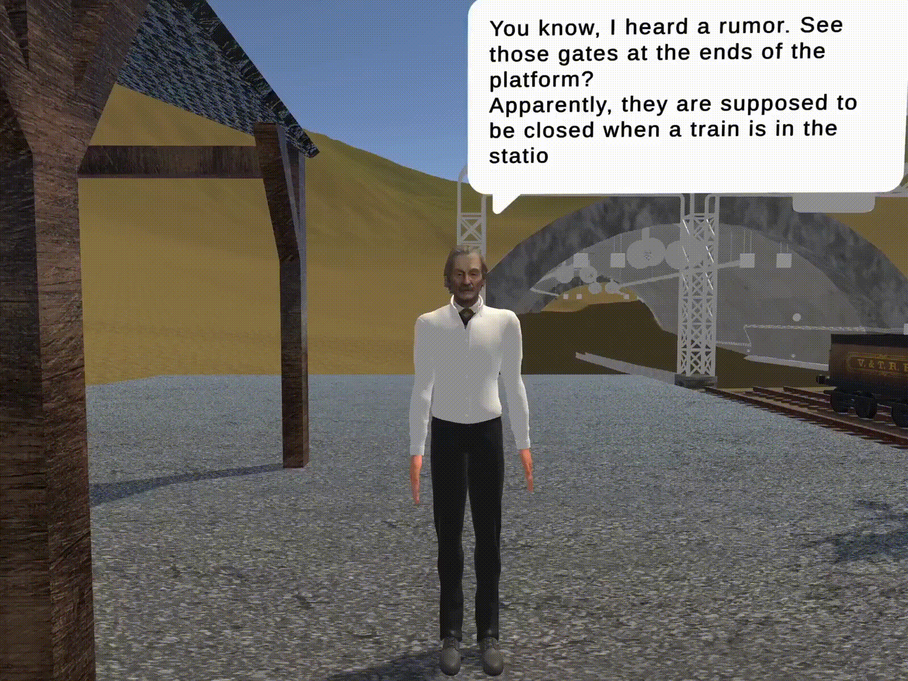
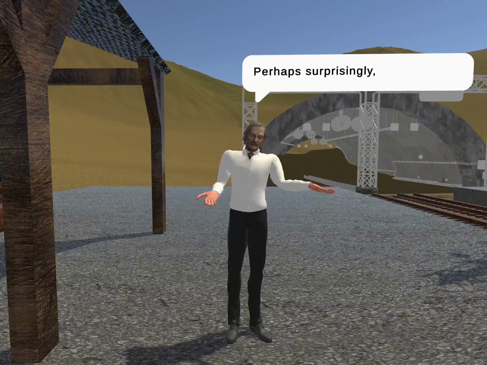
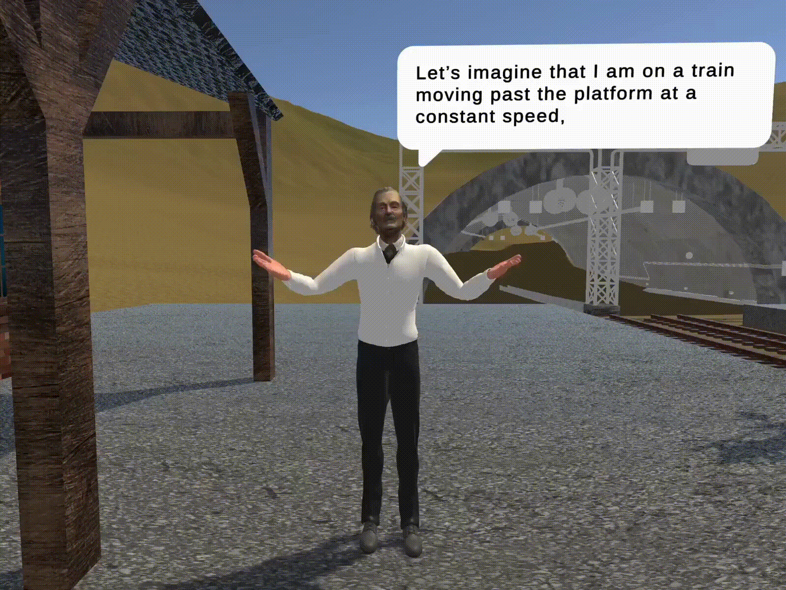
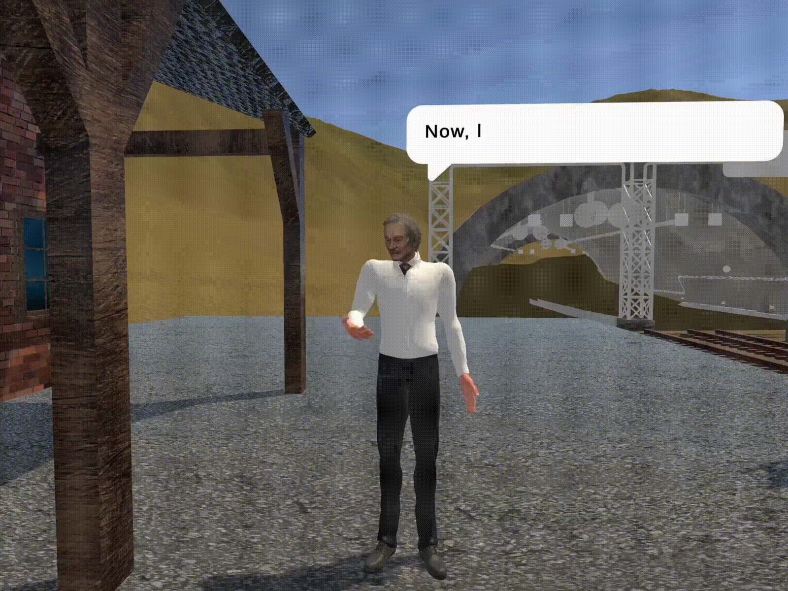

# SpecialRelativity

This project is a dialogue-based educational module in virtual reality that introduces learners to **Einstein’s Special Relativity**, focusing on the **relativity of simultaneity**.

It brings up a thought experiment to explain the principle of relativity of simultaneity in special relativity. The module features an Einstein character who guides the user through the train-in-the-tunnel paradox, where a train's length-contraction appears to conflict with the tunnel's length-contraction depending on the observer's frame of reference. The experience visually demonstrates how the constant speed of light resolves this paradox, showing that events that are simultaneous for one observer are not for another.

---

## Non-relativistic Introduction to Frames of Reference (FORs)

### Introduction to the Module

---

### Understanding Frames of Reference

Players explore **how motion is relative** depending on the observer’s frame.  
For example, a passenger on a train and an observer on the platform perceive motion differently, yet both descriptions are valid in their own FORs.

---

### Quick Quiz: The Falling Ball

Einstein drops a ball inside the moving train.

- How fast is it falling according to Einstein (on the train)?
- How fast is it moving according to the observer on the ground?

  
  

  
  

---

## Relativistic Effects

Einstein introduces **length contraction** and **time dilation** by accelerating the train to **70% the speed of light** (≈0.7c).

Players observe:

- The train appearing shorter (via **length contraction** equation: L = L₀√(1−v²/c²)).
- Time running slower on the moving stopwatch (**time dilation** equation: t = t₀/√(1−v²/c²)).

Players make predictions, test them by switching frames, and visually confirm both effects.

---

## The Barn Paradox (Train-in-the-Tunnel)

A recreation of the **classic barn paradox** in immersive 3D.  
Players witness the train fitting into a tunnel _only in one frame_ — leading to an apparent contradiction.

#### The Resolution

By introducing **relativity of simultaneity**, Einstein demonstrates:

- The gates do **not close simultaneously** in the train frame.
- Both perspectives are consistent once **spacetime** is considered.

Mechanism based on [this explanation video](https://www.youtube.com/watch?v=YAmHAKdyV1o&t=455s):

- Signal triggered at the track center travels at **speed of light**.
- Gates close upon receiving the signal.
- In TF, one gate moves toward the signal (closes earlier), the other away (closes later).

---

## Tech Stack

- **Unity 2022.3.15**
- **OpenXR SDK**

---

## 📂 Media Attribution

All GIFs located in `/src/`:
